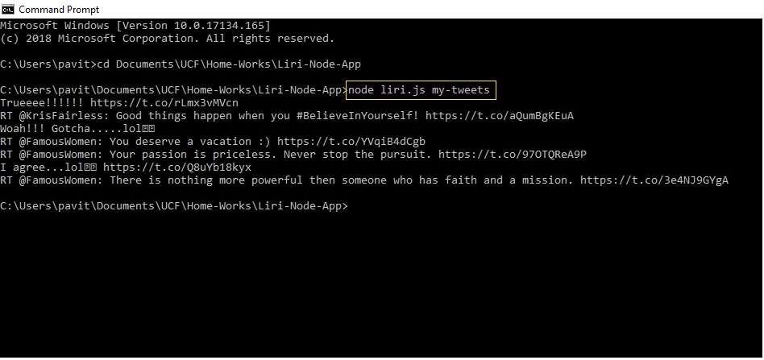
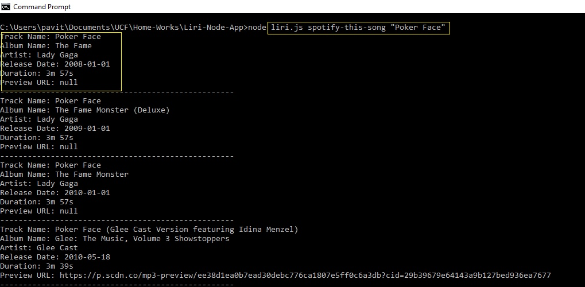
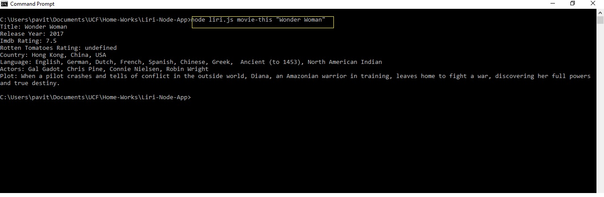
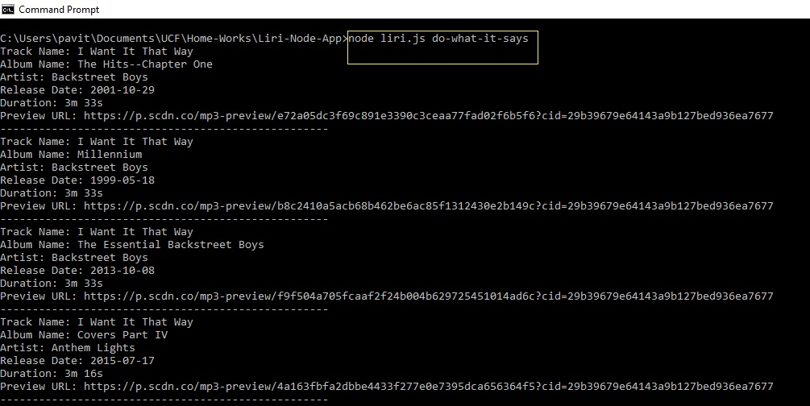

# Liri-Node_App
App for Liri (Node)
Liri is a command line application that runs on node.
It will make different API calls based on the command line input.

## my-tweets
The below command pull the recent tweets from my twitter account.
> node liri.js my-tweets

## spotify-this-song
The below command pulls the details of the song that is being searched.
> node liri.js spotify-this-song "Poker Face"

## movie-this
The below command pulls the details of the movie that is being searched.
> node liri.js movie-this "Wonder Woman"

## do-what-it-says
The below command excutes the command placed in the file random.txt
> node liri.js do-what-it-says

